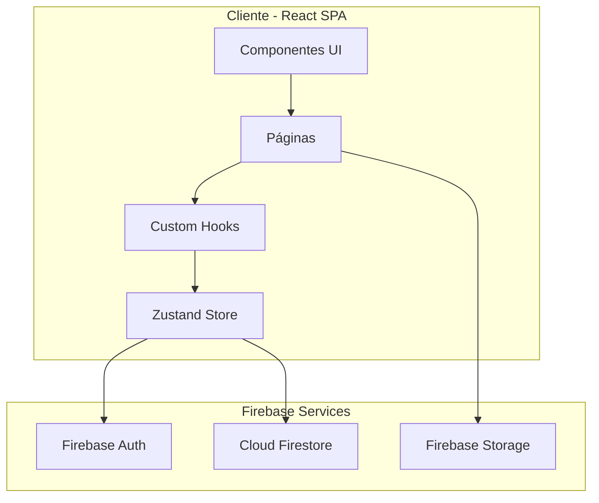
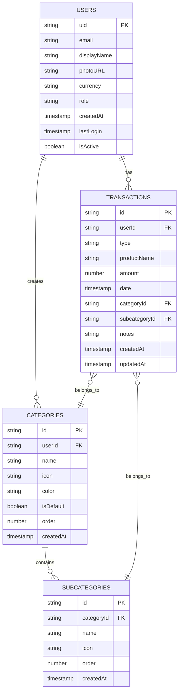
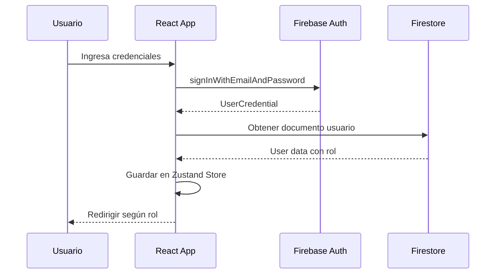

# FinanzaPro - Plan de Arquitectura Completo

## 📋 Resumen del Proyecto

**FinanzaPro** es una aplicación web de finanzas personales tipo SPA con diseño premium, sistema de roles (Usuario/Admin), y arquitectura escalable.

### Stack Tecnológico Seleccionado

| Categoría | Tecnología |
|-----------|------------|
| Framework | React 18 + Vite 5 |
| Lenguaje | TypeScript |
| Estilos | Tailwind CSS 3.4 |
| Animaciones | Framer Motion |
| Estado Global | Zustand |
| Backend/Auth | Firebase (Firestore + Auth) |
| Gráficos | Recharts |
| Iconos | Lucide React |
| Routing | React Router v6 |
| Formularios | React Hook Form + Zod |
| Deploy | Vercel |
| Idioma | Español (único) |

---

## 🏗️ Arquitectura del Sistema



---

## 📁 Estructura de Carpetas

```
finanzapro/
├── public/
│   ├── favicon.ico
│   └── manifest.json
├── src/
│   ├── assets/
│   │   ├── images/
│   │   └── fonts/
│   ├── components/
│   │   ├── ui/                    # Componentes base reutilizables
│   │   │   ├── Button.tsx
│   │   │   ├── Input.tsx
│   │   │   ├── Card.tsx
│   │   │   ├── Modal.tsx
│   │   │   ├── Dropdown.tsx
│   │   │   ├── Badge.tsx
│   │   │   ├── Avatar.tsx
│   │   │   ├── Skeleton.tsx
│   │   │   └── Toast.tsx
│   │   ├── layout/                # Componentes de estructura
│   │   │   ├── Sidebar.tsx
│   │   │   ├── BottomNav.tsx
│   │   │   ├── Header.tsx
│   │   │   ├── MainLayout.tsx
│   │   │   └── AdminLayout.tsx
│   │   ├── charts/                # Componentes de gráficos
│   │   │   ├── DonutChart.tsx
│   │   │   ├── LineChart.tsx
│   │   │   ├── BarChart.tsx
│   │   │   └── ChartContainer.tsx
│   │   ├── forms/                 # Formularios específicos
│   │   │   ├── ExpenseForm.tsx
│   │   │   ├── IncomeForm.tsx
│   │   │   ├── CategoryForm.tsx
│   │   │   └── ProfileForm.tsx
│   │   └── features/              # Componentes de funcionalidad
│   │       ├── TransactionList.tsx
│   │       ├── CategoryCard.tsx
│   │       ├── BalanceCard.tsx
│   │       ├── QuickActions.tsx
│   │       └── RecentActivity.tsx
│   ├── pages/
│   │   ├── auth/
│   │   │   ├── Login.tsx
│   │   │   ├── Register.tsx
│   │   │   └── ForgotPassword.tsx
│   │   ├── dashboard/
│   │   │   └── Dashboard.tsx
│   │   ├── transactions/
│   │   │   ├── Transactions.tsx
│   │   │   └── TransactionDetail.tsx
│   │   ├── categories/
│   │   │   └── Categories.tsx
│   │   ├── reports/
│   │   │   └── Reports.tsx
│   │   ├── settings/
│   │   │   └── Settings.tsx
│   │   └── admin/
│   │       ├── AdminDashboard.tsx
│   │       ├── UserManagement.tsx
│   │       └── GlobalMetrics.tsx
│   ├── hooks/
│   │   ├── useAuth.ts
│   │   ├── useTransactions.ts
│   │   ├── useCategories.ts
│   │   ├── useTheme.ts
│   │   ├── useMediaQuery.ts
│   │   └── useFirestore.ts
│   ├── store/
│   │   ├── authStore.ts
│   │   ├── transactionStore.ts
│   │   ├── categoryStore.ts
│   │   ├── uiStore.ts
│   │   └── index.ts
│   ├── services/
│   │   ├── firebase/
│   │   │   ├── config.ts
│   │   │   ├── auth.ts
│   │   │   ├── firestore.ts
│   │   │   └── storage.ts
│   │   └── api/
│   │       ├── transactions.ts
│   │       ├── categories.ts
│   │       └── users.ts
│   ├── types/
│   │   ├── transaction.ts
│   │   ├── category.ts
│   │   ├── user.ts
│   │   └── index.ts
│   ├── utils/
│   │   ├── formatters.ts
│   │   ├── validators.ts
│   │   ├── constants.ts
│   │   └── helpers.ts
│   ├── styles/
│   │   └── globals.css
│   ├── App.tsx
│   ├── main.tsx
│   └── vite-env.d.ts
├── .env.example
├── .gitignore
├── index.html
├── package.json
├── tailwind.config.js
├── tsconfig.json
├── vite.config.ts
└── README.md
```

---

## 🗄️ Esquema de Base de Datos (Firestore)

### Colecciones Principales



### Estructura Detallada de Documentos

#### Colección: `users`
```typescript
interface User {
  uid: string;                    // ID único de Firebase Auth
  email: string;
  displayName: string;
  photoURL?: string;
  currency: 'COP' | 'USD' | 'EUR' | 'MXN';
  role: 'user' | 'admin';
  settings: {
    theme: 'light' | 'dark' | 'system';
    notifications: boolean;
    language: 'es';
  };
  createdAt: Timestamp;
  lastLogin: Timestamp;
  isActive: boolean;
}
```

#### Colección: `transactions`
```typescript
interface Transaction {
  id: string;
  userId: string;
  type: 'income' | 'expense';
  productName: string;
  amount: number;
  date: Timestamp;
  categoryId: string;
  subcategoryId?: string;
  notes?: string;
  tags?: string[];
  isRecurring: boolean;
  recurringConfig?: {
    frequency: 'daily' | 'weekly' | 'monthly' | 'yearly';
    endDate?: Timestamp;
  };
  createdAt: Timestamp;
  updatedAt: Timestamp;
}
```

#### Colección: `categories`
```typescript
interface Category {
  id: string;
  userId: string | null;          // null = categoría predeterminada del sistema
  name: string;
  icon: string;                   // Nombre del icono de Lucide
  color: string;                  // Color hex
  type: 'income' | 'expense' | 'both';
  isDefault: boolean;
  order: number;
  createdAt: Timestamp;
}
```

#### Subcolección: `categories/{categoryId}/subcategories`
```typescript
interface Subcategory {
  id: string;
  name: string;
  icon?: string;
  order: number;
  createdAt: Timestamp;
}
```

### Categorías Predeterminadas

| Categoría | Icono | Color | Subcategorías |
|-----------|-------|-------|---------------|
| Alimentación | `utensils` | #10B981 | Supermercado, Restaurante, Delivery, Café |
| Transporte | `car` | #3B82F6 | Gasolina, Transporte público, Taxi/Uber, Mantenimiento |
| Entretenimiento | `gamepad-2` | #8B5CF6 | Cine, Streaming, Conciertos, Deportes |
| Juegos | `joystick` | #EC4899 | Videojuegos, Suscripciones, In-app purchases |
| Gastos Familiares | `users` | #F59E0B | Educación, Salud, Ropa, Regalos |
| Arriendo | `home` | #EF4444 | Arriendo, Servicios, Internet, Seguros |
| Ahorro | `piggy-bank` | #14B8A6 | Fondo de emergencia, Inversiones, Metas |
| Ingresos | `wallet` | #22C55E | Salario, Freelance, Inversiones, Otros |

---

## 🔐 Sistema de Autenticación y Roles

### Flujo de Autenticación



### Gestión de Roles

```typescript
// Middleware de protección de rutas
const ProtectedRoute = ({ children, requiredRole }) => {
  const { user, isLoading } = useAuthStore();
  
  if (isLoading) return <LoadingSpinner />;
  if (!user) return <Navigate to="/login" />;
  if (requiredRole && user.role !== requiredRole) {
    return <Navigate to="/dashboard" />;
  }
  
  return children;
};
```

### Asignación de Admin

El rol de administrador se asigna manualmente en Firestore:
1. Crear usuario normalmente via registro
2. En Firebase Console > Firestore > users > [uid]
3. Cambiar campo `role` de `user` a `admin`

---

## 🎨 Sistema de Diseño

### Paleta de Colores

```css
/* Light Mode */
--background: #F8FAFC;
--surface: #FFFFFF;
--surface-elevated: rgba(255, 255, 255, 0.8);
--text-primary: #0F172A;
--text-secondary: #64748B;
--border: #E2E8F0;
--accent: #6366F1;
--accent-hover: #4F46E5;

/* Dark Mode */
--background: #0F172A;
--surface: #1E293B;
--surface-elevated: rgba(30, 41, 59, 0.8);
--text-primary: #F8FAFC;
--text-secondary: #94A3B8;
--border: #334155;
--accent: #818CF8;
--accent-hover: #6366F1;
```

### Componentes Glassmorphism

```css
.glass-card {
  background: rgba(255, 255, 255, 0.1);
  backdrop-filter: blur(10px);
  border: 1px solid rgba(255, 255, 255, 0.2);
  border-radius: 16px;
}

.dark .glass-card {
  background: rgba(15, 23, 42, 0.6);
  border: 1px solid rgba(255, 255, 255, 0.1);
}
```

### Breakpoints Responsivos

| Breakpoint | Tamaño | Navegación |
|------------|--------|------------|
| Mobile | < 768px | Bottom Navigation |
| Tablet | 768px - 1024px | Sidebar colapsable |
| Desktop | > 1024px | Sidebar expandido |

---

## 📊 Especificaciones de Gráficos

### Dashboard Principal

1. **Balance Card** - Tarjeta hero con balance neto, ingresos y gastos del mes
2. **Donut Chart** - Distribución de gastos por categoría (top 5 + otros)
3. **Line Chart** - Evolución del ahorro mensual (últimos 6 meses)
4. **Recent Transactions** - Lista de últimas 5 transacciones

### Panel de Reportes

1. **Bar Chart** - Comparativa ingresos vs gastos por mes
2. **Area Chart** - Tendencia de gastos por categoría
3. **Table** - Detalle de transacciones con filtros

### Panel Admin

1. **Metric Cards** - Total usuarios, transacciones, volumen
2. **Line Chart** - Crecimiento de usuarios
3. **Bar Chart** - Actividad por día de la semana
4. **Data Table** - Gestión de usuarios con búsqueda y filtros

---

## 🔄 Gestión de Estado (Zustand)

### Stores Principales

```typescript
// authStore.ts
interface AuthState {
  user: User | null;
  isLoading: boolean;
  isAuthenticated: boolean;
  login: (email: string, password: string) => Promise<void>;
  logout: () => Promise<void>;
  register: (data: RegisterData) => Promise<void>;
  updateProfile: (data: Partial<User>) => Promise<void>;
}

// transactionStore.ts
interface TransactionState {
  transactions: Transaction[];
  isLoading: boolean;
  filters: TransactionFilters;
  addTransaction: (data: TransactionInput) => Promise<void>;
  updateTransaction: (id: string, data: Partial<Transaction>) => Promise<void>;
  deleteTransaction: (id: string) => Promise<void>;
  setFilters: (filters: TransactionFilters) => void;
  getByDateRange: (start: Date, end: Date) => Transaction[];
  getByCategory: (categoryId: string) => Transaction[];
}

// categoryStore.ts
interface CategoryState {
  categories: Category[];
  isLoading: boolean;
  addCategory: (data: CategoryInput) => Promise<void>;
  updateCategory: (id: string, data: Partial<Category>) => Promise<void>;
  deleteCategory: (id: string) => Promise<void>;
  addSubcategory: (categoryId: string, data: SubcategoryInput) => Promise<void>;
}

// uiStore.ts
interface UIState {
  theme: 'light' | 'dark' | 'system';
  sidebarOpen: boolean;
  modalOpen: string | null;
  toast: ToastMessage | null;
  setTheme: (theme: Theme) => void;
  toggleSidebar: () => void;
  openModal: (modalId: string) => void;
  closeModal: () => void;
  showToast: (message: ToastMessage) => void;
}
```

---

## 🛣️ Rutas de la Aplicación

```typescript
const routes = [
  // Públicas
  { path: '/login', element: <Login /> },
  { path: '/register', element: <Register /> },
  { path: '/forgot-password', element: <ForgotPassword /> },
  
  // Protegidas - Usuario
  { path: '/', element: <Navigate to="/dashboard" /> },
  { path: '/dashboard', element: <Dashboard /> },
  { path: '/transactions', element: <Transactions /> },
  { path: '/transactions/:id', element: <TransactionDetail /> },
  { path: '/categories', element: <Categories /> },
  { path: '/reports', element: <Reports /> },
  { path: '/settings', element: <Settings /> },
  
  // Protegidas - Admin
  { path: '/admin', element: <AdminDashboard />, requiredRole: 'admin' },
  { path: '/admin/users', element: <UserManagement />, requiredRole: 'admin' },
  { path: '/admin/metrics', element: <GlobalMetrics />, requiredRole: 'admin' },
  
  // 404
  { path: '*', element: <NotFound /> },
];
```

---

## 📱 Wireframes de Referencia

### Dashboard Mobile

```
┌─────────────────────────┐
│  FinanzaPro    👤  🌙   │
├─────────────────────────┤
│  ┌─────────────────┐    │
│  │  Balance Neto   │    │
│  │  $2,450,000     │    │
│  │  ↑ +$500K  ↓-$1.2M │ │
│  └─────────────────┘    │
│                         │
│  ┌─────────────────┐    │
│  │   [Donut Chart] │    │
│  │   Por Categoría │    │
│  └─────────────────┘    │
│                         │
│  Actividad Reciente     │
│  ├─ 🍔 Restaurante -$45K│
│  ├─ 💰 Salario  +$3.5M  │
│  └─ 🚗 Gasolina  -$80K  │
│                         │
├─────────────────────────┤
│  🏠   📊   ➕   📁   ⚙️  │
└─────────────────────────┘
```

### Dashboard Desktop

```
┌────────────────────────────────────────────────────────────────┐
│  🏦 FinanzaPro                              👤 Pablo   🌙  ⚙️  │
├──────────┬─────────────────────────────────────────────────────┤
│          │                                                     │
│  🏠 Home │   Balance del Mes                                   │
│          │   ┌──────────┐ ┌──────────┐ ┌──────────┐           │
│  📊 Trans│   │ Balance  │ │ Ingresos │ │ Gastos   │           │
│          │   │ $2.45M   │ │ $3.5M    │ │ $1.05M   │           │
│  📁 Categ│   └──────────┘ └──────────┘ └──────────┘           │
│          │                                                     │
│  📈 Report│  ┌─────────────────┐  ┌─────────────────┐          │
│          │   │  [Donut Chart]  │  │  [Line Chart]   │          │
│  ⚙️ Config│  │  Gastos x Cat   │  │  Ahorro Mensual │          │
│          │   └─────────────────┘  └─────────────────┘          │
│          │                                                     │
│  ─────── │   Transacciones Recientes                           │
│  👑 Admin│   ┌─────────────────────────────────────┐           │
│          │   │ Producto │ Categoría │ Monto │ Fecha│           │
│          │   ├──────────┼───────────┼───────┼──────┤           │
│          │   │ Almuerzo │ Comidas   │ -$25K │ Hoy  │           │
│          │   │ Salario  │ Ingresos  │ +$3.5M│ 15/01│           │
│          │   └─────────────────────────────────────┘           │
└──────────┴─────────────────────────────────────────────────────┘
```

---

## 🚀 Fases de Implementación

### Fase 1: Fundamentos
- [ ] Inicializar proyecto Vite + React + TypeScript
- [ ] Configurar Tailwind CSS y tema base
- [ ] Configurar Firebase (Auth + Firestore)
- [ ] Crear estructura de carpetas
- [ ] Implementar sistema de rutas básico
- [ ] Crear componentes UI base

### Fase 2: Autenticación
- [ ] Implementar páginas de Login/Register
- [ ] Configurar Firebase Auth
- [ ] Crear authStore con Zustand
- [ ] Implementar protección de rutas
- [ ] Crear hook useAuth

### Fase 3: Core Features
- [ ] Implementar CRUD de transacciones
- [ ] Crear sistema de categorías con subcategorías
- [ ] Implementar Dashboard principal
- [ ] Crear gráficos con Recharts
- [ ] Implementar filtros y búsqueda

### Fase 4: UI/UX Avanzado
- [ ] Implementar Dark Mode
- [ ] Crear animaciones con Framer Motion
- [ ] Optimizar responsive design
- [ ] Implementar Bottom Navigation mobile
- [ ] Agregar feedback visual (toasts, loading states)

### Fase 5: Panel Admin
- [ ] Crear layout de administrador
- [ ] Implementar métricas globales
- [ ] Crear tabla de gestión de usuarios
- [ ] Implementar gráficos de crecimiento

### Fase 6: Optimización y Deploy
- [ ] Optimizar queries de Firestore
- [ ] Implementar lazy loading
- [ ] Configurar PWA básico
- [ ] Deploy a Vercel
- [ ] Testing y corrección de bugs

---

## 📝 Variables de Entorno

```env
# .env.example
VITE_FIREBASE_API_KEY=your_api_key
VITE_FIREBASE_AUTH_DOMAIN=your_project.firebaseapp.com
VITE_FIREBASE_PROJECT_ID=your_project_id
VITE_FIREBASE_STORAGE_BUCKET=your_project.appspot.com
VITE_FIREBASE_MESSAGING_SENDER_ID=your_sender_id
VITE_FIREBASE_APP_ID=your_app_id
```

---

## ✅ Checklist de Requisitos

| Requisito | Estado |
|-----------|--------|
| CRUD de gastos con todos los campos | ⬜ |
| Sistema de categorías dinámico | ⬜ |
| Subcategorías jerárquicas | ⬜ |
| CRUD de categorías personalizadas | ⬜ |
| Dashboard con balance neto | ⬜ |
| Gráfico donut por categoría | ⬜ |
| Gráfico línea de ahorro mensual | ⬜ |
| Diseño Glassmorphism/Minimalista | ⬜ |
| Dark Mode de alta calidad | ⬜ |
| Responsive (mobile + desktop) | ⬜ |
| Bottom nav mobile / Sidebar desktop | ⬜ |
| Registro/Login seguro | ⬜ |
| Configuración de perfil y moneda | ⬜ |
| Panel Admin exclusivo | ⬜ |
| Métricas globales admin | ⬜ |
| Gestión de usuarios admin | ⬜ |

---

## 🔗 Dependencias del Proyecto

```json
{
  "dependencies": {
    "react": "^18.2.0",
    "react-dom": "^18.2.0",
    "react-router-dom": "^6.21.0",
    "firebase": "^10.7.0",
    "zustand": "^4.4.7",
    "recharts": "^2.10.3",
    "framer-motion": "^10.16.16",
    "lucide-react": "^0.303.0",
    "react-hook-form": "^7.49.2",
    "zod": "^3.22.4",
    "@hookform/resolvers": "^3.3.2",
    "date-fns": "^3.0.6",
    "clsx": "^2.0.0",
    "tailwind-merge": "^2.2.0"
  },
  "devDependencies": {
    "@types/react": "^18.2.45",
    "@types/react-dom": "^18.2.18",
    "@vitejs/plugin-react": "^4.2.1",
    "autoprefixer": "^10.4.16",
    "postcss": "^8.4.32",
    "tailwindcss": "^3.4.0",
    "typescript": "^5.3.3",
    "vite": "^5.0.10"
  }
}
```

---

*Documento generado para el proyecto FinanzaPro - Última actualización: Enero 2026*
